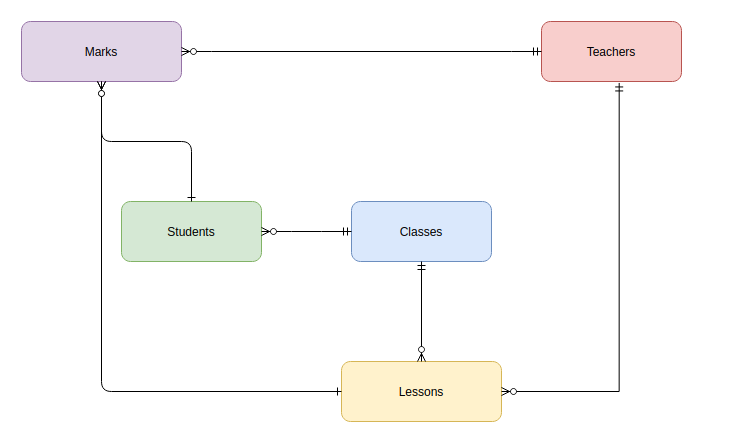
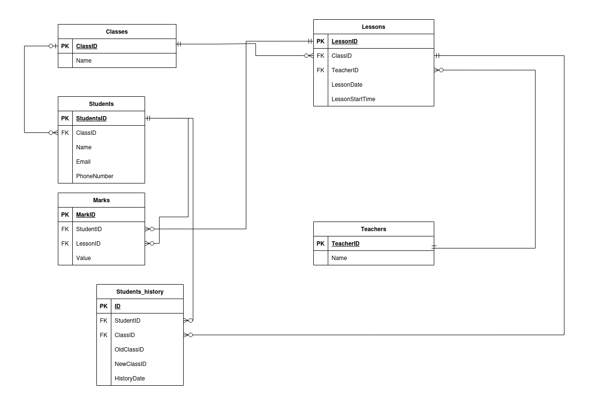

Проект представляет базу данных учебного заведения (школы), предназначенную для хранения и обработки информации об образовательном процессе.

База данных спроектирована с соблюдением требований третьей нормальной формы: все атрибуты являются атомарными, отсутствуют составные ключи и транзитивные зависимости. Такая структура была разработана с самого начала, что позволило естественным образом достичь требуемой нормализации.

Для таблицы, содержащей данные об учениках, реализовано версионирование данных по методологии SCD Type 4. Это обусловлено возможностью изменения классов, в которых обучаются учащиеся, что позволяет сохранять полную историю изменений.

В каталоге docs размещены файлы, содержащие концептуальную, логическую и физическую модели базы данных.




## Таблица Teachers

| **Column Name** | **Data Type**   | **Nullable** | **Key** | **Constraints / Notes**                  |
|-----------------|-----------------|--------------|---------|------------------------------------------|
| TeacherID       | INTEGER         | NOT NULL     | PK      | Primary Key, AUTO_INCREMENT              |
| Name            | VARCHAR(200)    | NOT NULL     |         |                                          |

---

## Таблица Classes

| **Column Name** | **Data Type**   | **Nullable** | **Key** | **Constraints / Notes**                  |
|-----------------|-----------------|--------------|---------|------------------------------------------|
| ClassID         | INTEGER         | NOT NULL     | PK      | Primary Key, AUTO_INCREMENT              |
| Name            | VARCHAR(200)    | NOT NULL     |         |                                          |

---

## Таблица Students

| **Column Name** | **Data Type**   | **Nullable** | **Key** | **Constraints / Notes**                                                           |
|-----------------|-----------------|--------------|---------|-----------------------------------------------------------------------------------|
| StudentID       | INTEGER         | NOT NULL     | PK      | Primary Key, AUTO_INCREMENT                                                       |
| ClassID         | INTEGER         | Nullable     | FK      | Foreign Key: References Classes(ClassID); ON DELETE SET NULL                        |
| Name            | VARCHAR(200)    | NOT NULL     |         |                                                                                   |
| Email           | VARCHAR(255)    | NOT NULL     |         | Рекомендуется UNIQUE, если email должен быть уникальным                           |
| PhoneNumber     | VARCHAR(50)     |              |         |                                                                                   |

---

## Таблица Lessons

| **Column Name**    | **Data Type**  | **Nullable** | **Key** | **Constraints / Notes**                                                          |
|--------------------|----------------|--------------|---------|----------------------------------------------------------------------------------|
| LessonID           | INTEGER        | NOT NULL     | PK      | Primary Key, AUTO_INCREMENT                                                      |
| ClassID            | INTEGER        | NOT NULL     | FK      | Foreign Key: References Classes(ClassID); ON DELETE CASCADE                        |
| TeacherID          | INTEGER        | NOT NULL     | FK      | Foreign Key: References Teachers(TeacherID); ON DELETE CASCADE                       |
| LessonDate         | DATE           | NOT NULL     |         |                                                                                  |
| LessonStartTime    | TIME           |              |         | Время начала урока                                                               |

---

## Таблица Marks

| **Column Name** | **Data Type**  | **Nullable** | **Key** | **Constraints / Notes**                                                                     |
|-----------------|----------------|--------------|---------|---------------------------------------------------------------------------------------------|
| MarkID          | INTEGER        | NOT NULL     | PK      | Primary Key, AUTO_INCREMENT                                                                 |
| StudentID       | INTEGER        | NOT NULL     | FK      | Foreign Key: References Students(StudentID); ON DELETE CASCADE                                |
| LessonID        | INTEGER        | NOT NULL     | FK      | Foreign Key: References Lessons(LessonID); ON DELETE CASCADE                                   |
| Value           | INTEGER        | NOT NULL     |         | CHECK (Value >= 1 AND Value <= 10)                                                            |

> **Примечание**: Поле TeacherID удалено, так как преподаватель определяется через таблицу Lessons.

---

## Таблица Students_history

| **Column Name** | **Data Type**  | **Nullable** | **Key** | **Constraints / Notes**                                                                         |
|-----------------|----------------|--------------|---------|-------------------------------------------------------------------------------------------------|
| ID              | INTEGER        | NOT NULL     | PK      | Primary Key, AUTO_INCREMENT                                                                     |
| StudentID       | INTEGER        | NOT NULL     | FK      | Foreign Key: References Students(StudentID); ON DELETE CASCADE                                  |
| OldClassID      | INTEGER        | NOT NULL     | FK      | Foreign Key: References Classes(ClassID); ON DELETE CASCADE (класс, в котором студент был ранее)   |
| NewClassID      | INTEGER        | NOT NULL     | FK      | Foreign Key: References Classes(ClassID); ON DELETE CASCADE (класс, в который студент перешёл)      |
| HistoryDate     | DATE           | NOT NULL     |         |                                                                                                 |


# Инструкция по запуску тестов

## 1. Активация виртуального окружения

Если вы ещё не активировали виртуальное окружение проекта, выполните:

```bash
python3 -m venv venv
source venv/bin/activate
```

После этого в подсказке терминала появится `(venv)`.

## 2. Установка зависимостей

Убедитесь, что все необходимые пакеты установлены:

```bash
pip install --upgrade pip
pip install -r requirements.txt
```

Это установит pytest и все зависимости для работы тестов.

## 3. Запуск тестов

В корне проекта выполните команду:

```bash
pytest
```

Pytest автоматически найдёт все файлы `tests/test_*.py` и запустит 10 тестов, проверяющих корректность SQL-запросов.

## 4. Просмотр отчёта покрытия

Чтобы сгенерировать отчёт покрытия кода (coverage), выполните:

```bash
pytest --cov=. --cov-report=html
```

После этого в папке `htmlcov/` появятся HTML-файлы отчёта. Для быстрого просмотра откройте в браузере:

* **Linux**: `xdg-open htmlcov/index.html`
* **macOS**: `open htmlcov/index.html`
* **Windows**: `start htmlcov\index.html`
